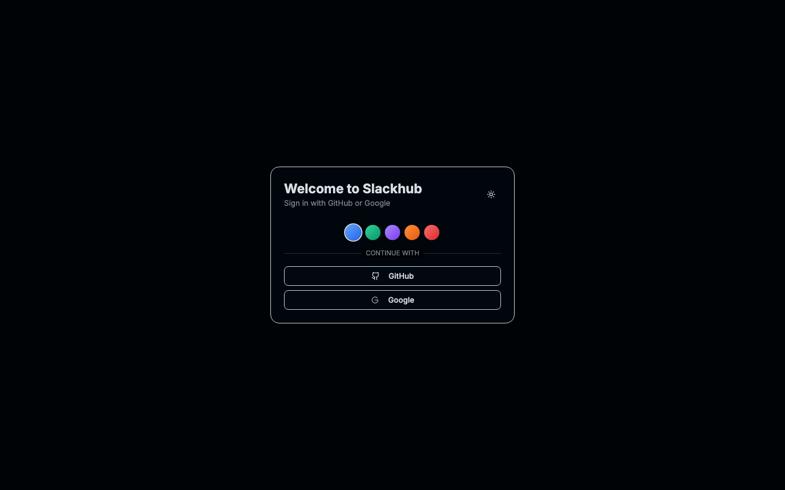

# SlackHub Messenger

A modern Slack-like chat application built with React 19, TypeScript, Vite, Tailwind CSS v4, shadcn/ui (Radix UI), and Supabase for authentication, database, storage, and real-time updates.

## Screenshots

Below are automatic screenshots captured with Playwright from the running dev server:

<div align="center">


<br/>



</div>

## Current Capabilities

- Real-time messaging via Supabase Realtime
- Channels: create, edit, delete
- Threads: reply to messages and view thread counts
- Emoji reactions with per-user attribution
- File attachments with preview (images/video) via Supabase Storage
- User status (active, away, busy) with presence and profile sync
- Search UI for messages and channels
- Rich text editing with TipTap
- Keyboard shortcuts and quick switcher
- Theming: light/dark + color themes (persisted via localStorage; DB sync planned)
- Responsive layout (mobile/desktop)

Notes:
- Email/password auth is disabled. OAuth (GitHub and optional Google) is supported.
- Voice/video calling is planned, but not implemented yet.

## Prerequisites

- Node.js 18+ and npm
- A Supabase account and project

## Setup

### 1) Supabase Setup

1. Create a new project at [supabase.com](https://supabase.com)
2. Go to your project's SQL Editor
3. Copy and paste the contents of `supabase-schema.sql` and run it
4. Go to Authentication > Settings and configure your auth providers:
   - GitHub OAuth: Add your GitHub OAuth app credentials (required)
   - Google OAuth: Optional
5. Go to Settings > API to find your project URL and anon key

### 2) Environment Configuration

1. Copy the environment template:
   ```bash
   cp .env.example .env
   ```

2. Fill in your Supabase credentials:
   ```env
   VITE_SUPABASE_URL=https://your-project-id.supabase.co
   VITE_SUPABASE_ANON_KEY=your-anon-key-here
   ```

### 3) Install Dependencies

```bash
npm install
```

### 4) Run the Application

```bash
npm run dev
```

The app will be available at `http://localhost:5173`.

## Database Schema (high level)

Key tables used by the app (see `docs/architecture/DATABASE_SCHEMA.md` for details):

- `users` — Profile data synced with Supabase Auth metadata
- `channels` — Chat channels
- `messages` — Messages with optional `thread_id`
- `reactions` — Emoji reactions per user and message
- `user_settings` — Optional: theme/notification preferences (not used by UI yet)

## Authentication

- OAuth (GitHub required, Google optional)
- Email/password is intentionally disabled
- Profile bootstrap on first login (user row upserted from OAuth metadata)

## Real-time

Backed by Supabase Realtime (Postgres CDC over WebSocket):

- Instant message inserts/edits/deletes
- Channel create/update/delete
- Reactions add/remove
- Presence-backed user status updates

## Key Modules

- `AuthComponent` — OAuth sign-in UI and configuration warnings
- `useAuth` — Auth/session + profile bootstrap (OAuth only)
- `useSupabaseData` — Channels/messages/reactions + realtime subscriptions
- `useSupabaseSettings` — Theme + settings (DB sync with local cache)
- `useSupabaseUserStatus` — Presence and profile status

## Migration Notes (from earlier KV-based versions)

- Authentication: moved to Supabase Auth (OAuth)
- Data storage: PostgreSQL (Supabase) with RLS
- Real-time: Supabase Realtime replaces local-only state
- User profiles/settings: normalized in database

## Deployment

1. Build the project:
   ```bash
   npm run build
   ```

2. Deploy to your preferred hosting platform (Vercel, Netlify, etc.)

3. Make sure to set the environment variables in your deployment platform

## Development

- Hot reload with Vite
- TypeScript (strict)
- ESLint + project conventions
- Tailwind CSS v4 with design tokens

## Contributing

1. Fork the repository
2. Create a feature branch
3. Make your changes
4. Test thoroughly
5. Submit a pull request

## License

MIT License - feel free to use this code for your own projects.

---

More docs:

- Architecture: `docs/architecture/ARCHITECTURE.md`
- Database Schema: `docs/architecture/DATABASE_SCHEMA.md`
- Development Guide: `docs/development/DEVELOPMENT.md`
- API Reference: `docs/development/API.md`
- Components: `docs/development/COMPONENTS.md`
- Setup: `docs/setup/SUPABASE_SETUP.md`