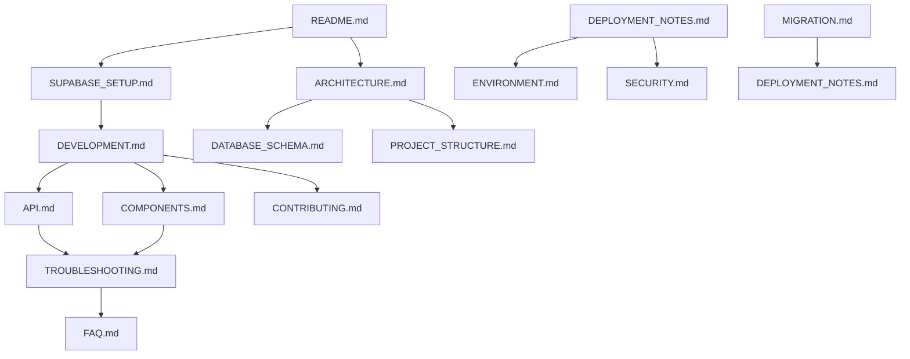

# SlackHub Messenger - Documentation Hub

This document provides a comprehensive overview of the project's documentation structure and how different documents relate to each other.

## 📁 Documentation Structure

```
docs/
├── architecture/                       # System design and structure
│   ├── ARCHITECTURE.md                # System architecture with Mermaid diagrams
│   ├── DATABASE_SCHEMA.md             # Database design and relationships
│   └── PROJECT_STRUCTURE.md           # Code organization patterns
├── development/                        # Development resources
│   ├── API.md                         # Hooks, components, and utilities reference
│   ├── COMPONENTS.md                  # UI component specifications
│   ├── CONTRIBUTING.md                # Contribution workflow and guidelines
│   └── DEVELOPMENT.md                 # Complete development workflow
├── deployment/                         # Production deployment
│   ├── DEPLOYMENT_NOTES.md            # Production deployment notes and config
│   └── ENVIRONMENT.md                 # Environment variables and configuration
├── reference/                          # Reference materials
│   ├── FAQ.md                         # Frequently asked questions
│   ├── MIGRATION.md                   # Version migration assistance
│   └── TROUBLESHOOTING.md             # Common issues and solutions
└── setup/                             # Initial setup
    └── SUPABASE_SETUP.md              # Environment configuration
```

## 🔗 Cross-References and Dependencies

### Documentation Flow
1. New users: Main README → SUPABASE_SETUP.md → DEVELOPMENT.md
2. Developers: DEVELOPMENT.md → API.md → COMPONENTS.md → CONTRIBUTING.md
3. Architecture: ARCHITECTURE.md → DATABASE_SCHEMA.md → PROJECT_STRUCTURE.md
4. Deployment: ENVIRONMENT.md → DEPLOYMENT_NOTES.md
5. Support: TROUBLESHOOTING.md → FAQ.md → MIGRATION.md

### Key References
- [Copilot Instructions](../.github/copilot-instructions.md) — Coding guidelines for this repo
- [Main README](../README.md) — Project overview and quick start
 
## ✅ Current Capabilities (2025-08-09)

- Real-time messaging with threads and reactions
- Channels CRUD + unread tracking
- OAuth auth (GitHub required, Google optional); email/password disabled
- User profiles and status (active/away/busy); presence-backed
- File uploads with previews via Supabase Storage
- Rich text editor (TipTap), search, quick switcher, keyboard shortcuts
- Theming (light/dark + color themes) synced via DB with local cache

Planned (not yet implemented in UI): Voice/video calling.

## 📚 Document Purposes

### Architecture
- [ARCHITECTURE.md](./architecture/ARCHITECTURE.md): Complete system design with visual diagrams
- [DATABASE_SCHEMA.md](./architecture/DATABASE_SCHEMA.md): Database structure and relationships
- [PROJECT_STRUCTURE.md](./architecture/PROJECT_STRUCTURE.md): Code organization and file structure

### Development
- [DEVELOPMENT.md](./development/DEVELOPMENT.md): Development environment setup and workflow
- [API.md](./development/API.md): API reference for hooks and components
- [COMPONENTS.md](./development/COMPONENTS.md): UI component library documentation
- [CONTRIBUTING.md](./development/CONTRIBUTING.md): How to contribute

### Deployment
- [DEPLOYMENT_NOTES.md](./deployment/DEPLOYMENT_NOTES.md): Production deployment notes
- [ENVIRONMENT.md](./deployment/ENVIRONMENT.md): Environment configuration reference

### Reference
- [FAQ.md](./reference/FAQ.md): Common questions and answers
- [TROUBLESHOOTING.md](./reference/TROUBLESHOOTING.md): Problem diagnosis and solutions
- [MIGRATION.md](./reference/MIGRATION.md): Version upgrade and migration assistance

### Setup
- [SUPABASE_SETUP.md](./setup/SUPABASE_SETUP.md): Backend setup instructions

## 🎯 Documentation Usage Patterns

### For Different Roles

#### **New Contributors**
1. Start with [README.md](./README.md) for overview
2. Follow [SUPABASE_SETUP.md](./setup/SUPABASE_SETUP.md) for environment setup
3. Review [DEVELOPMENT.md](./development/DEVELOPMENT.md) for development practices
4. Check [CONTRIBUTING.md](./development/CONTRIBUTING.md) for contribution guidelines
5. Reference [Copilot Instructions](../.github/copilot-instructions.md) for coding standards

#### **Feature Development**
1. Review [ARCHITECTURE.md](./architecture/ARCHITECTURE.md) for system understanding
2. Check [API.md](./development/API.md) for available hooks and utilities
3. Reference [COMPONENTS.md](./development/COMPONENTS.md) for UI patterns
4. Follow [DEVELOPMENT.md](./development/DEVELOPMENT.md) for implementation guidelines

#### **Bug Fixes**
1. Check [TROUBLESHOOTING.md](./reference/TROUBLESHOOTING.md) for known issues
2. Review [FAQ.md](./reference/FAQ.md) for common problems
3. Reference [DATABASE_SCHEMA.md](./architecture/DATABASE_SCHEMA.md) for data-related issues
4. Use [API.md](./development/API.md) for hook usage patterns

#### **Deployment & Operations**
1. Follow [DEPLOYMENT_NOTES.md](./deployment/DEPLOYMENT_NOTES.md) for production setup
2. Configure with [ENVIRONMENT.md](./deployment/ENVIRONMENT.md)
3. Implement [SECURITY.md](./security/SECURITY.md) guidelines
4. Monitor using [TROUBLESHOOTING.md](./reference/TROUBLESHOOTING.md)

## 📖 Documentation Maintenance

### Status Tracking
| Document | Status | Last Updated |
|----------|--------|--------------|
| Architecture | ✅ Current | 2025-08-09 |
| Database Schema | ✅ Current | 2025-08-09 |
| Development Guide | ✅ Current | 2025-08-09 |
| API Documentation | ✅ Current | 2025-08-09 |
| Component Library | ✅ Current | 2025-08-09 |
| Setup Guide | ✅ Current | 2025-08-09 |
| Deployment Notes | ✅ Current | 2025-08-09 |

### Update Guidelines
- **Architecture changes**: Update ARCHITECTURE.md and related diagrams
- **New components**: Update COMPONENTS.md and API.md
- **Database changes**: Update DATABASE_SCHEMA.md and migration docs
- **Security updates**: Update SECURITY.md and deployment guides
- **Bug fixes**: Update TROUBLESHOOTING.md and FAQ.md

## 🔍 Search and Navigation

### Quick Reference Links
- Getting Started: [Setup Guide](./setup/SUPABASE_SETUP.md)
- Development: [Development Guide](./development/DEVELOPMENT.md)
- API Reference: [API Documentation](./development/API.md)
- Components: [Component Library](./development/COMPONENTS.md)
- Architecture: [System Architecture](./architecture/ARCHITECTURE.md)
- Database: [Database Schema](./architecture/DATABASE_SCHEMA.md)
- Deployment: [Deployment Notes](./deployment/DEPLOYMENT_NOTES.md)
- Troubleshooting: [Troubleshooting Guide](./reference/TROUBLESHOOTING.md)
- FAQ: [Frequently Asked Questions](./reference/FAQ.md)

### Document Relationships


---

For questions about documentation structure or content, please refer to our [Contributing Guidelines](./development/CONTRIBUTING.md).
