# SlackHub Messenger - Architecture Documentation

## Table of Contents
1. [Overview](#overview)
2. [System Architecture](#system-architecture)
3. [Frontend Architecture](#frontend-architecture)
4. [Backend Architecture](#backend-architecture)
5. [Database Schema](#database-schema)
6. [Authentication Flow](#authentication-flow)
7. [Real-time Data Flow](#real-time-data-flow)
8. [Component Architecture](#component-architecture)
9. [State Management](#state-management)
10. [Technology Stack](#technology-stack)
11. [Deployment Architecture](#deployment-architecture)

## Overview

SlackHub Messenger is a modern, real-time chat application that provides Slack-like functionality with channels, direct messaging, file sharing, and rich text editing. The application is built using a serverless architecture with Supabase as the backend-as-a-service provider.

### Key Features
- Real-time messaging with threading support
- Channel and direct message management
- File attachments with preview
- Keyboard shortcuts and accessibility features
- Emoji reactions and rich text editing
- User status management
- Multiple authentication methods
- Responsive design with theming support

## System Architecture

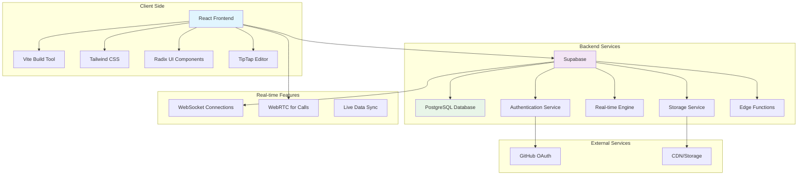

## Frontend Architecture

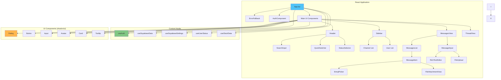

## Backend Architecture

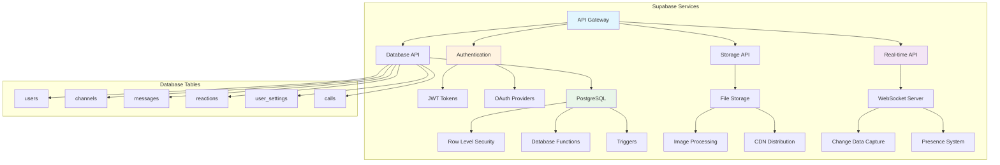

## Database Schema

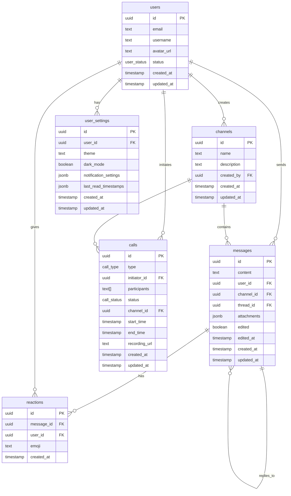

## Authentication Flow

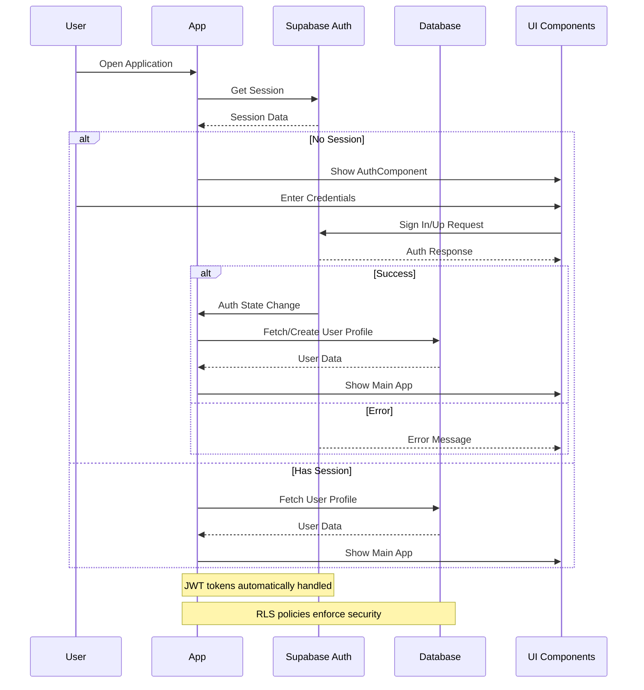

## Real-time Data Flow

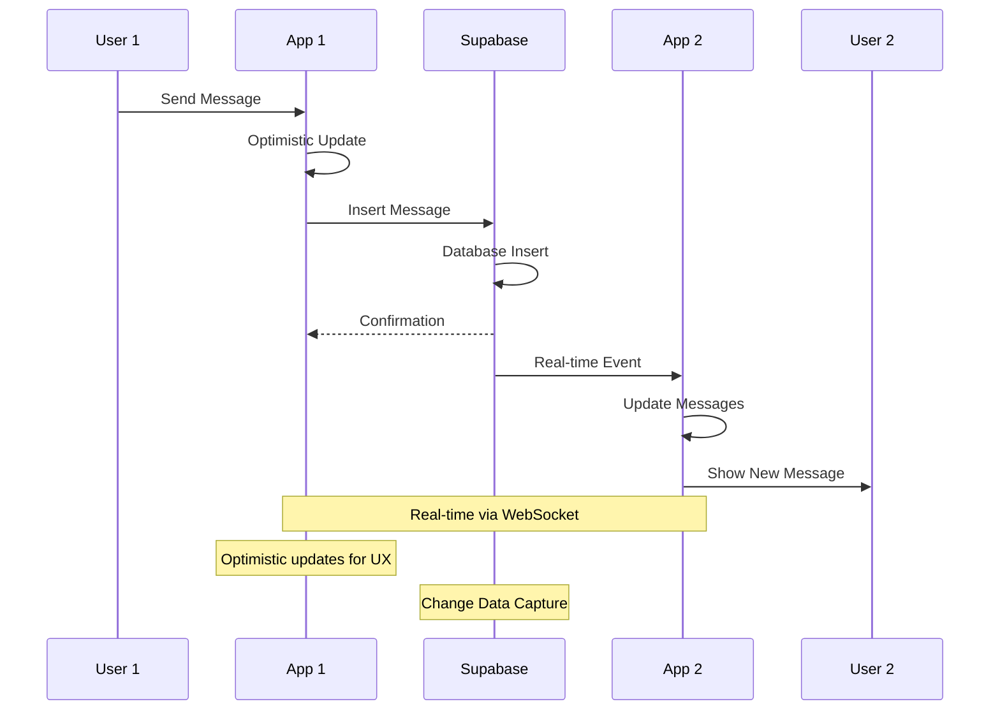

## Component Architecture

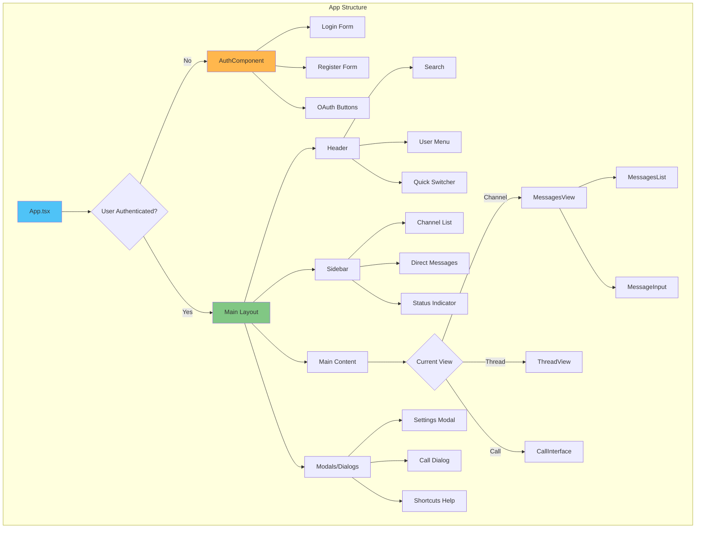

## State Management

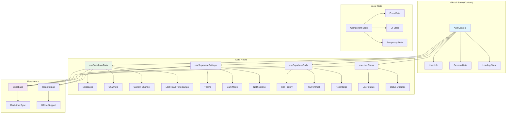

## Technology Stack

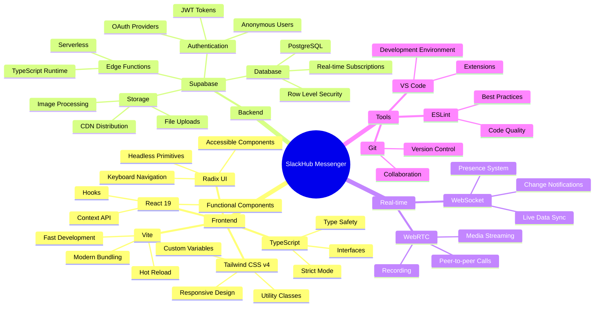

## Deployment Architecture

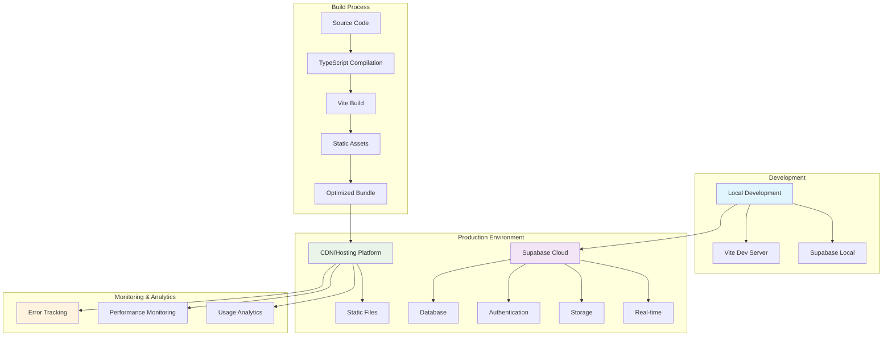

## Data Flow Patterns

### Optimistic Updates
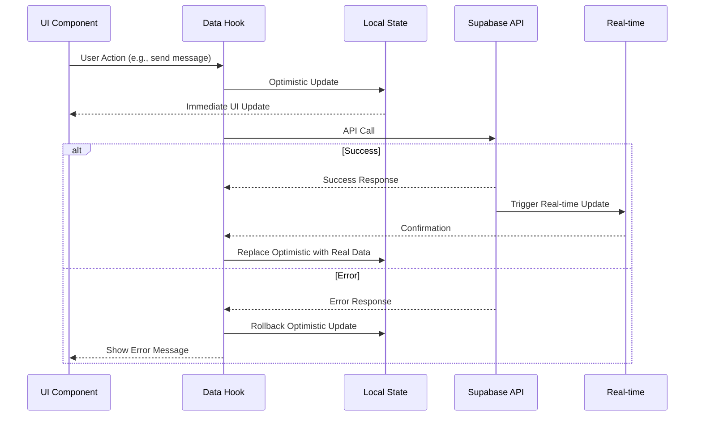

### Real-time Synchronization
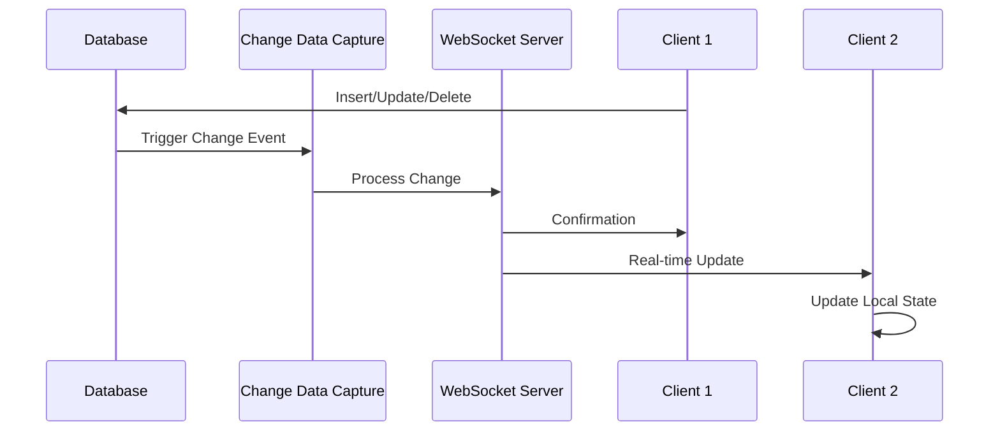

## Security Architecture

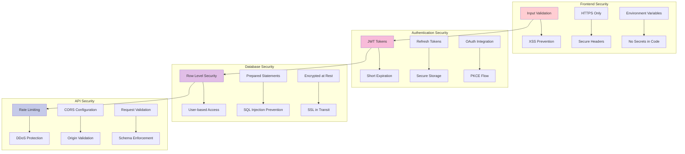

## Performance Optimization

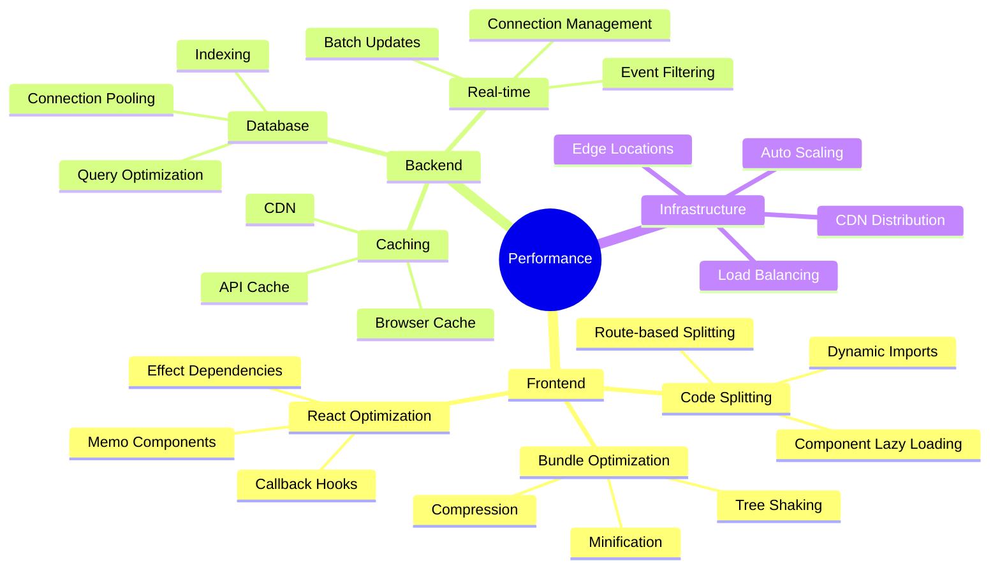

---

This architecture document provides a comprehensive view of the SlackHub Messenger application, from high-level system design to detailed component interactions. The Mermaid diagrams illustrate the relationships between different parts of the system and help understand the data flow, security measures, and performance considerations.
