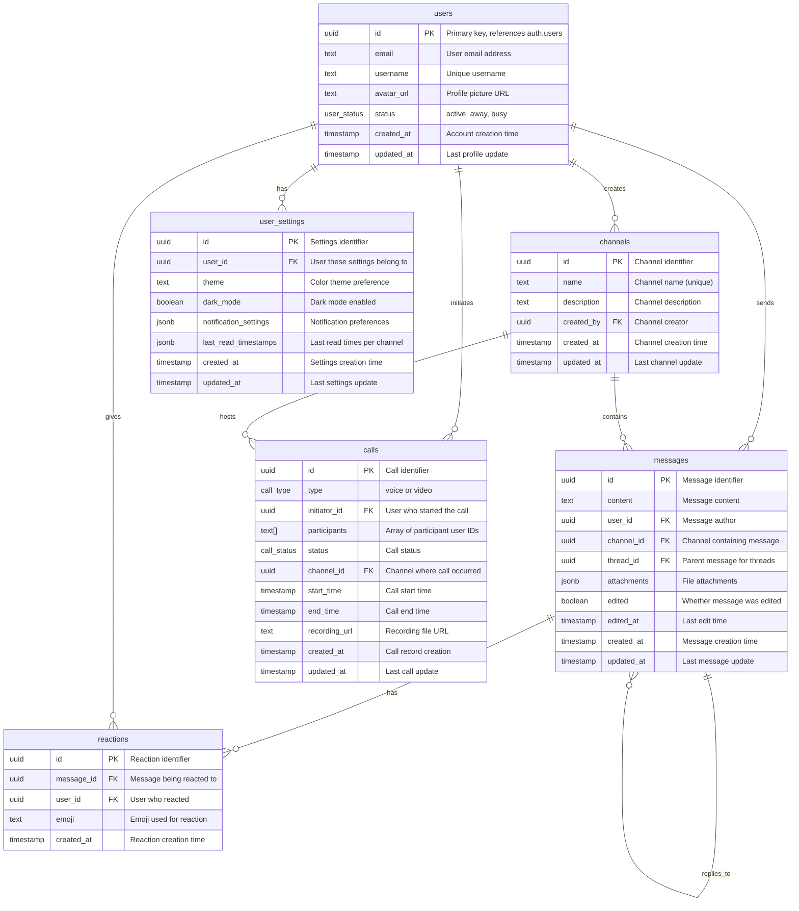

# Database Schema Documentation

This document provides detailed information about the SlackHub Messenger database schema, table relationships, and data models.

## Overview

The SlackHub Messenger application uses PostgreSQL as the primary database, hosted on Supabase. The schema is designed to support real-time chat functionality and user management. Calling features are planned and documented below for future reference.

## Database Schema Diagram



## Table Specifications

### users
Extends Supabase's built-in `auth.users` table with application-specific profile data.

| Column | Type | Constraints | Description |
|--------|------|-------------|-------------|
| `id` | UUID | PRIMARY KEY, REFERENCES auth.users(id) | User identifier |
| `email` | TEXT | NOT NULL | User email address |
| `username` | TEXT | NOT NULL, UNIQUE | Display name |
| `avatar_url` | TEXT | | Profile picture URL |
| `status` | user_status | DEFAULT 'active' | Current user status |
| `created_at` | TIMESTAMPTZ | DEFAULT NOW() | Account creation |
| `updated_at` | TIMESTAMPTZ | DEFAULT NOW() | Last profile update |

**Indexes:**
- Primary key on `id`
- Unique index on `username`
- Index on `status` for user presence queries

### channels
Chat channels/rooms where messages are organized.

| Column | Type | Constraints | Description |
|--------|------|-------------|-------------|
| `id` | UUID | PRIMARY KEY | Channel identifier |
| `name` | TEXT | NOT NULL, UNIQUE | Channel name |
| `description` | TEXT | | Channel description |
| `created_by` | UUID | REFERENCES users(id) | Channel creator |
| `created_at` | TIMESTAMPTZ | DEFAULT NOW() | Creation time |
| `updated_at` | TIMESTAMPTZ | DEFAULT NOW() | Last update |

**Indexes:**
- Primary key on `id`
- Unique index on `name`
- Index on `created_by`

### messages
Individual chat messages with threading support.

| Column | Type | Constraints | Description |
|--------|------|-------------|-------------|
| `id` | UUID | PRIMARY KEY | Message identifier |
| `content` | TEXT | NOT NULL | Message text content |
| `user_id` | UUID | REFERENCES users(id) | Message author |
| `channel_id` | UUID | REFERENCES channels(id) | Containing channel |
| `thread_id` | UUID | REFERENCES messages(id) | Parent message (for threads) |
| `attachments` | JSONB | | File attachments array |
| `edited` | BOOLEAN | DEFAULT FALSE | Edit flag |
| `edited_at` | TIMESTAMPTZ | | Last edit time |
| `created_at` | TIMESTAMPTZ | DEFAULT NOW() | Creation time |
| `updated_at` | TIMESTAMPTZ | DEFAULT NOW() | Last update |

**Indexes:**
- Primary key on `id`
- Index on `channel_id` for channel queries
- Index on `user_id` for user message history
- Index on `thread_id` for thread queries
- Index on `created_at` for chronological ordering

### reactions
Emoji reactions to messages.

| Column | Type | Constraints | Description |
|--------|------|-------------|-------------|
| `id` | UUID | PRIMARY KEY | Reaction identifier |
| `message_id` | UUID | REFERENCES messages(id) | Target message |
| `user_id` | UUID | REFERENCES users(id) | User who reacted |
| `emoji` | TEXT | NOT NULL | Emoji character/code |
| `created_at` | TIMESTAMPTZ | DEFAULT NOW() | Reaction time |

**Constraints:**
- Unique constraint on `(message_id, user_id, emoji)` - one reaction per emoji per user per message

**Indexes:**
- Primary key on `id`
- Index on `message_id`
- Index on `user_id`

### user_settings
User preferences and application settings (optional; UI currently uses localStorage, DB sync planned).

| Column | Type | Constraints | Description |
|--------|------|-------------|-------------|
| `id` | UUID | PRIMARY KEY | Settings identifier |
| `user_id` | UUID | REFERENCES users(id), UNIQUE | Settings owner |
| `theme` | TEXT | DEFAULT 'blue' | Color theme |
| `dark_mode` | BOOLEAN | DEFAULT FALSE | Dark mode preference |
| `notification_settings` | JSONB | DEFAULT '{}' | Notification preferences |
| `last_read_timestamps` | JSONB | DEFAULT '{}' | Per-channel read status |
| `created_at` | TIMESTAMPTZ | DEFAULT NOW() | Settings creation |
| `updated_at` | TIMESTAMPTZ | DEFAULT NOW() | Last update |

**Notification Settings Structure:**
```json
{
  "soundEnabled": true,
  "soundVolume": 50,
  "soundType": "subtle",
  "desktopNotifications": true,
  "allMessages": false,
  "directMessages": true,
  "mentions": true,
  "keywords": ["urgent", "help"],
  "channelSettings": {
    "channel-id": {
      "muted": false,
      "mentions": true
    }
  },
  "doNotDisturb": false,
  "quietHours": {
    "enabled": false,
    "startTime": "22:00",
    "endTime": "08:00"
  }
}
```

### calls
Voice and video call records (future; proposed table; not present in current SQL schema; UI not implemented yet).

| Column | Type | Constraints | Description |
|--------|------|-------------|-------------|
| `id` | UUID | PRIMARY KEY | Call identifier |
| `type` | call_type | NOT NULL | 'voice' or 'video' |
| `initiator_id` | UUID | REFERENCES users(id) | Call starter |
| `participants` | TEXT[] | NOT NULL | Participant user IDs |
| `status` | call_status | DEFAULT 'idle' | Current call status |
| `channel_id` | UUID | REFERENCES channels(id) | Associated channel |
| `start_time` | TIMESTAMPTZ | NOT NULL | Call start time |
| `end_time` | TIMESTAMPTZ | | Call end time |
| `recording_url` | TEXT | | Recording file URL |
| `created_at` | TIMESTAMPTZ | DEFAULT NOW() | Record creation |
| `updated_at` | TIMESTAMPTZ | DEFAULT NOW() | Last update |

**Indexes:**
- Primary key on `id`
- GIN index on `participants` for array queries
- Index on `status` for active call queries

## Custom Types

### user_status
```sql
CREATE TYPE user_status AS ENUM ('active', 'away', 'busy');
```

### call_type
```sql
CREATE TYPE call_type AS ENUM ('voice', 'video');
```

### call_status
```sql
CREATE TYPE call_status AS ENUM ('idle', 'calling', 'ringing', 'connected', 'ended', 'declined', 'missed');
```

## Row Level Security (RLS)

All tables have RLS enabled with the following policies:

### users
- **SELECT**: All authenticated users can view user profiles
- **INSERT**: Users can create their own profile
- **UPDATE**: Users can update their own profile only

### channels
- **SELECT**: All users can view channels
- **INSERT**: Authenticated users can create channels
- **UPDATE/DELETE**: Only channel creators can modify their channels

### messages
- **SELECT**: All users can view messages
- **INSERT**: Authenticated users can create messages
- **UPDATE/DELETE**: Users can modify their own messages only

### reactions
- **SELECT**: All users can view reactions
- **INSERT**: Authenticated users can add reactions
- **DELETE**: Users can remove their own reactions only

### user_settings
- **ALL**: Users can only access their own settings

### calls
- **SELECT**: Users can view calls they participated in
- **INSERT**: Authenticated users can create call records
- **UPDATE**: Call participants can update call status

## Triggers and Functions

### Update Timestamps
Automatic `updated_at` timestamp updates on row modifications:

```sql
CREATE OR REPLACE FUNCTION update_updated_at_column()
RETURNS TRIGGER AS $$
BEGIN
    NEW.updated_at = NOW();
    RETURN NEW;
END;
$$ language 'plpgsql';
```

Applied to all tables with `updated_at` columns.

### Real-time Notifications
Database triggers enable real-time subscriptions for:
- New messages
- Message reactions
- Channel updates
- User status changes
- Call status updates

## Performance Considerations

### Indexing Strategy
- **Primary Keys**: All tables use UUID primary keys
- **Foreign Keys**: Indexed for join performance
- **Timestamp Columns**: Indexed for chronological queries
- **Array Columns**: GIN indexes for array searches
- **JSONB Columns**: GIN indexes for JSON queries

### Query Optimization
- Use prepared statements for common queries
- Limit result sets with pagination
- Use `SELECT` specific columns instead of `*`
- Leverage indexes for `WHERE` clauses

### Scalability
- Connection pooling through Supabase
- Read replicas for query scaling
- Partitioning considerations for large message tables
- Archive old data to maintain performance

## Backup and Recovery

### Automated Backups
- Daily automated backups through Supabase
- Point-in-time recovery available
- Cross-region backup replication

### Data Retention
- Messages: Indefinite retention
- Call recordings: 90 days (configurable)
- User sessions: 30 days
- Audit logs: 1 year

---

For implementation details, see the `supabase-schema.sql` file in the project root.
